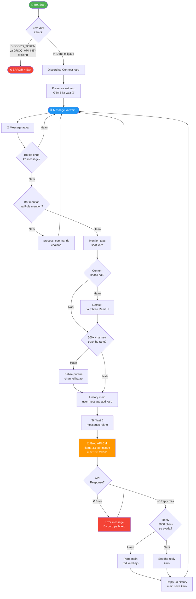

# 🚩 Rammu Bhai — Discord Gaming Bot

**Rammu Bhai** ek Hindi/Hinglish gaming Discord bot hai jo Groq AI (LLaMA) use karta hai.  
Creator: **hunternumber01** | Powered by: **Groq API** + **discord.py**

---

## 🔄 Bot Ka Working Flowchart



---

## ⚡ Commands

| Command | Kaam |
|---------|------|
| `@Rammu Bhai <message>` | Bot se baat karo |
| `!clear` | Is channel ki history saaf karo |
| `!ramram` | Rammu Bhai se greeting lo |
| `!gta6` | GTA 6 ki latest info |

---

## 🛠️ Setup

### 1. Environment Variables (Railway Dashboard mein set karo)
```
DISCORD_TOKEN=your_discord_bot_token
GROQ_API_KEY=your_groq_api_key
```

### 2. Discord Developer Portal
- **MESSAGE CONTENT INTENT** enable karo (Privileged Gateway Intents)

### 3. Groq API
- Free account: [console.groq.com](https://console.groq.com)
- Model: `llama-3.3-70b-versatile`

---

## 📦 Dependencies

```
discord.py==2.3.2
groq==0.11.0
httpx==0.27.2
python-dotenv==1.0.1
audioop-lts==0.2.1
```

---

## 🚀 Railway Deployment

- `Procfile` mein `worker: python bot.py` — koi web server nahi chahiye
- Railway pe push karo → automatic redeploy hoga

**Jai Shree Ram! 🙏**
